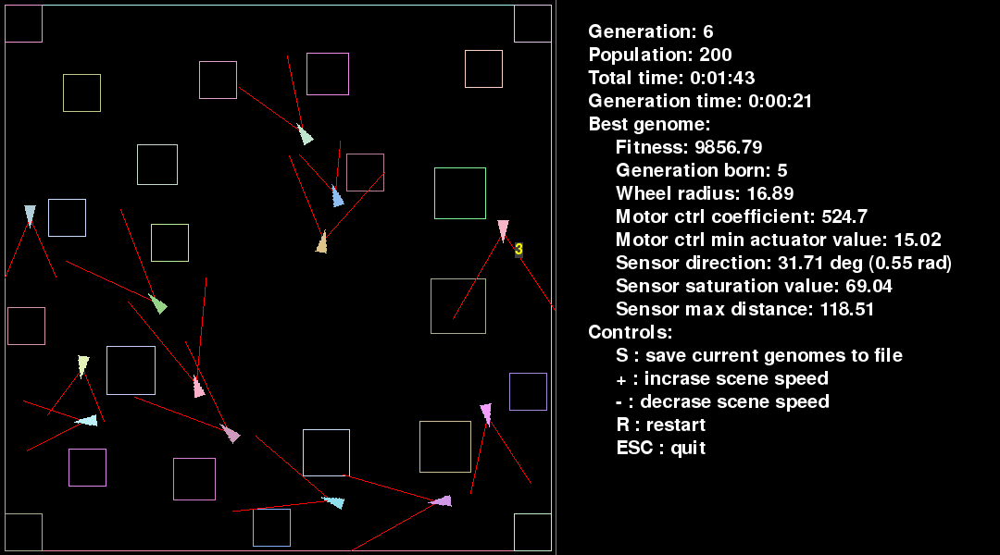

# BRAVE

BRAVE (BRAitenberg Vehicles Evolution) is a [genetic algorithm](https://en.wikipedia.org/wiki/Genetic_algorithm) engine and a simulator for [Braitenberg vehicles](https://en.wikipedia.org/wiki/Braitenberg_vehicle) written in Python.

A demo of the genetic algorithm execution is avalable on [YouTube](https://youtu.be/MXiJbRZ7j-c).

## Requirements

* Python 3.5+
* [Pygame](https://www.pygame.org/news) 1.9.3+

## The vehicles

A Braitenberg vehicle is an agent that can autonomously move around based on its sensor inputs.
Depending on how sensors and wheels are connected, the vehicle exhibits different behaviors.

BRAVE agents have two wheels, each driven directly by a simple sensor placed on a side of its body; they can exhibit two behaviors: [phototaxis](https://en.wikipedia.org/wiki/Phototaxis) and [obstacle avoidance](https://en.wikipedia.org/wiki/Obstacle_avoidance).

The vehicles are placed in a virtual environment called *scene*, along with the objects they interact with, i.e. light sources or obstacles.

The behavior of an agent is influenced by various parameters, such as the size of its wheels, the direction of its sensors, and so on. These parameters can be set programmatically for both obstacle avoidance and phototaxis. High-quality obstacle avoidance parameter values can be generated using a [genetic algorithm](https://en.wikipedia.org/wiki/Genetic_algorithm).

## Phototaxis

A phototaxis simulator is provided in `phototaxis.py`. The Python script accepts the following command line arguments:
* `-h`, `--help`   show a help message
* `-s FILE`, `--scene FILE`   path to a scene file; a custom scene for the phototaxis simulator can be specified
* `-f NUM`, `--fps NUM`   frame rate of the simulation

## Obstacle avoidance simulator

An obstacle avoidance simulator is provided in `obstacle_avoidance.py`. The Python script accepts the following command line arguments:
* `-h`, `--help`   show a help message
* `-g FILE`, `--genomes FILE`   load obstacle avoidance vehicles from file. Every line in the file represents a *genome*, that is the set of obstacle avoidance parameters used by a vehicle. By default, only the first 10 genomes of the file are loaded
* `-a`, `--load_all_genomes`   load all the genomes contained in a genome file, instead of the first 10. Applicable with `--genomes` parameter only
* `-s FILE`, `--scene FILE`   path of the scene file; a custom scene for the obstacle avoidance simulator can be specified
* `-f NUM`, `--fps NUM`   frame rate of the simulation

## Genetic algorithm for obstacle avoidance

High-quality obstacle avoidance can be generated executing a [genetic algorithm](https://en.wikipedia.org/wiki/Genetic_algorithm). The parameters that involve obstacle avoidance behavior are:

* **vehicle wheel radius**: affects vehicle speed
* **motor controller coefficient**: affects how much a detected obstacle makes the vehicle steer
* **motor controller minimum actuator value**: affects the speed of the vehicle when no obstacles are detected
* **sensor delta direction**: relative angle (in radians) between sensor and vehicle bearing
* **sensor saturation value**
* **sensor maximum distance**

The set of these parameters compose a *genome*, the genetic representation of a candidate solution. During the execution of the genetic algorithm, a population of genomes is evolved toward better solutions, applying [crossover](https://en.wikipedia.org/wiki/Crossover_(genetic_algorithm)) and [mutation](https://en.wikipedia.org/wiki/Mutation_(genetic_algorithm)). The [fitness](https://en.wikipedia.org/wiki/Fitness_function) of every genome is evaluated considering the distance traveled by the related vehicle before colliding with an obstacle.

The genetic algorithm for obstacle avoidance is provided in `evolution_obstacle_avoidance.py`. The Python script accepts the following command line arguments:

* `-h`, `--help`   show a help message
* `-v {0,1,2}`, `--verbose {0,1,2}`   set script verbosity
* `-p NUM`, `--population NUM`   number of vehicles in each generation
* `-e NUM`, `--elite NUM`   number of vehicles carried over unaltered to a new generation (elitism)
* `-m NUM`, `--mutation_prob NUM`   probability that a mutation occurs on a single gene
* `-M NUMv`, `--mutation_coeff NUM`   coefficient used to alter a gene value during mutation
* `-S NUM`, `--selection_ratio NUM`   ratio of parents selected to breed a new generation
* `-r`, `--random_direction`   set an initial random direction for the vehicles. If enabled, the fitness value of elite genomes will change in subsequent generations
* `-E NUM`, `--sensor_error NUM`   coefficient used to simulate the obstacle sensor read error. If non-zero, the fitness value of elite genomes will change in subsequent generations
* `-l`, `--long_lasting_generations`   enable long lasting generations. By default, generations have a time limit: if reached, all remaining robots are destroyed and a new generation is created. If this parameter is enabled, generations don't have a time limit
* `-c`, `--multicore`   enable multicore support (experimental)
* `-s FILE`, `--scene FILE`   path of the scene file; a custom scene for the genetic algorithm can be specified
* `-f NUM`, `--fps NUM`   frame rate of the genetic algorithm execution

A demo of the genetic algorithm execution is avalable on [YouTube](https://youtu.be/MXiJbRZ7j-c).

## License

[GNU GPLv3](LICENSE)
